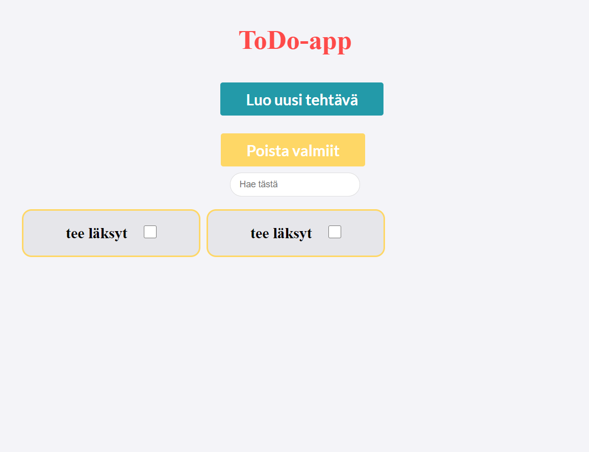
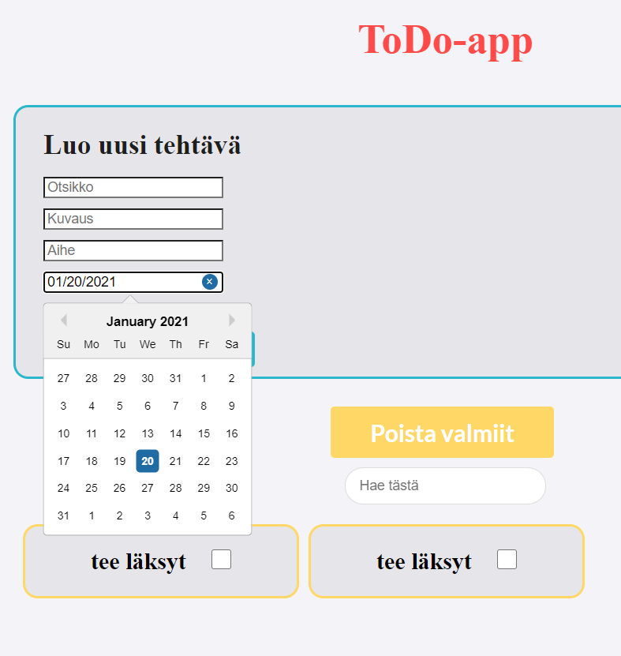
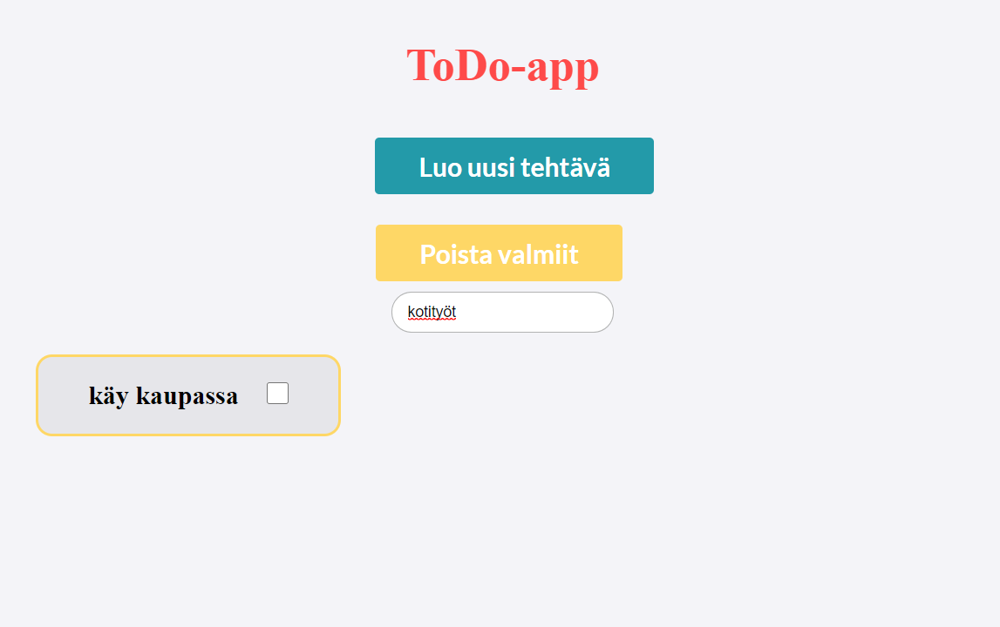

# ToDo-app frontend repository

Implemented with node.js, MySQL and react.js.
You can find the app from https://todo-tiko.herokuapp.com/.  

# Features:
<ul>
  <li>Add items to list</li>
  <li>Choose date from calendar</li>
  <li>Choose rating with stars</li>
  <li>Check items</li>
  <li>Search with tag or title</li>
  <li>Delete checked items</li>
</ul>

