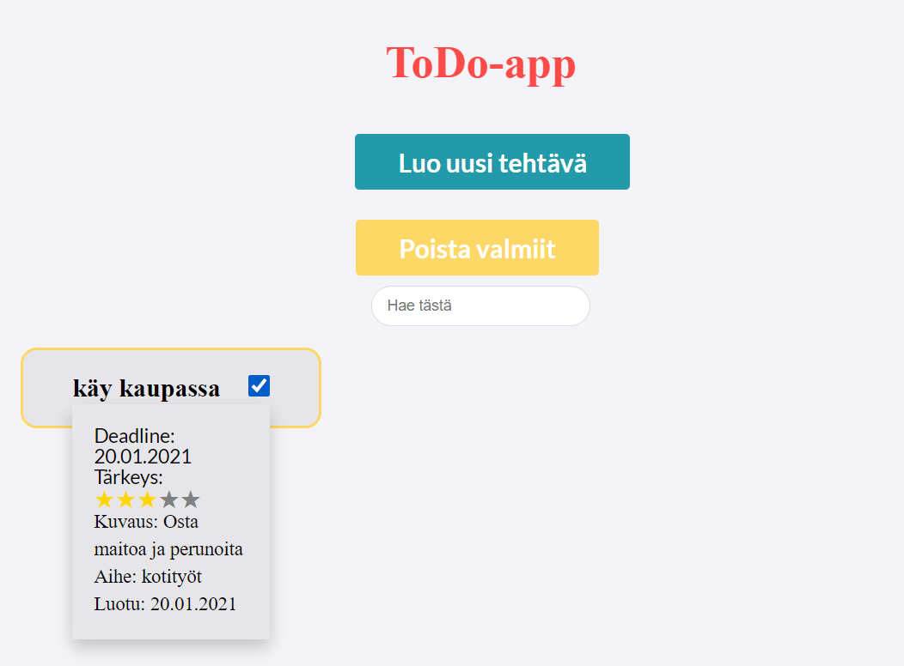

# ToDo-app frontend repository

Implemented with node.js, MySQL and react.js.
You can find the app from https://todo-tiko.herokuapp.com/.  

# Features:
<li>
  <ul>Add items to list</ul>
  <ul>Choose date from calendar</ul>
  <ul>Choose rating with stars</ul>
  <ul>Check items</ul>
  <ul>Search with tag or title</ul>
  <ul>Delete checked items</ul>
</li>

